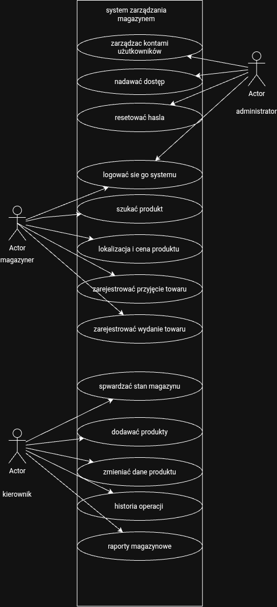

# 📦 Elektro-Bud — Analiza Wymagań Systemowych

> **Projekt:** System Zarządzania Magazynem  
> **Kontekst:** Opracowano na podstawie nagrania rozmowy z klientem oraz dokumentacji potrzeb biznesowych hurtowni materiałów elektrycznych i budowlanych.  
> **Status:** Gotowe do wdrożenia / Do potwierdzenia z klientem  

---

## 1. Wymagania Funkcjonalne (FR)

| ID | Nazwa wymagania | Szczegółowy opis funkcjonalności |
| :--- | :--- | :--- |
| **FR-01** | Logowanie użytkownika | System umożliwia użytkownikowi zalogowanie się przy użyciu indywidualnych danych dostępowych. |
| **FR-02** | Logowanie kartą identyfikacyjną | System umożliwia logowanie za pomocą fizycznej karty lub numeru ID pracownika. |
| **FR-03** | Indywidualne konta użytkowników | Każdy pracownik posiada własne konto. System kategorycznie blokuje współdzielenie jednego konta przez wiele osób. |
| **FR-04** | Zarządzanie kontami | Administrator ma możliwość tworzenia, edycji oraz dezaktywacji kont użytkowników. |
| **FR-05** | Nadawanie ról i uprawnień | Administrator może przypisać użytkownikowi określoną rolę systemową, która definiuje jego uprawnienia. |
| **FR-06** | Reset hasła | Administrator posiada funkcję zdalnego zresetowania hasła dowolnego użytkownika. |
| **FR-07** | Dodawanie produktu | Kierownik ma możliwość dodania nowego produktu do bazy, definiując: kod EAN, nazwę, kategorię, cenę oraz miejsce przechowywania. |
| **FR-08** | Edycja produktu | Kierownik posiada uprawnienia do modyfikacji i aktualizacji danych istniejącego produktu. |
| **FR-09** | Wyszukiwanie po kodzie EAN | System udostępnia wyszukiwarkę produktów na podstawie skanowania lub wpisania kodu EAN. |
| **FR-10** | Wyszukiwanie po nazwie | System umożliwia wyszukanie produktu po jego pełnej nazwie lub wpisanym fragmencie tekstowym. |
| **FR-11** | Wyszukiwanie po innych kryteriach | System pozwala na filtrowanie i wyszukiwanie produktów według kategorii oraz konkretnej lokalizacji. |
| **FR-12** | Wyświetlanie lokalizacji i ceny | Karta produktu w systemie prezentuje jego dokładne miejsce przechowywania (sektor/regał) oraz cenę. |
| **FR-13** | Podgląd stanu magazynowego | System rejestruje i przechowuje aktualną ilość każdego produktu w magazynie. Funkcja podglądu stanu jest dostępna dla kierownika. |
| **FR-14** | Rejestracja przyjęcia towaru | Magazynier ma możliwość zatwierdzenia przyjęcia nowej dostawy towaru, co automatycznie zwiększa stan magazynowy. |
| **FR-15** | Rejestracja wydania towaru | Magazynier ma możliwość zarejestrowania wydania towaru z magazynu, co automatycznie zmniejsza dostępny stan. |
| **FR-16** | Blokada wydania ponad stan | System automatycznie blokuje próby wydania większej liczby sztuk produktu, niż wynosi jego aktualna dostępność w bazie. |
| **FR-17** | Obsługa równoczesnych operacji | System poprawnie przetwarza transakcje w sytuacji, gdy dwóch pracowników modyfikuje ten sam produkt jednocześnie. Stan magazynowy pozostaje spójny. |
| **FR-18** | Historia operacji | System automatycznie loguje każdą akcję magazynową, zapisując: typ produktu, ilość, identyfikator wykonawcy oraz dokładną sygnaturę czasową. |
| **FR-19** | Przeglądanie historii | Kierownik posiada uprawnienia do wglądu w pełną historię operacji i logów magazynowych. |
| **FR-20** | Raporty magazynowe | Kierownik ma możliwość generowania raportów podsumowujących stan magazynu. *Zakres raportów wymaga doprecyzowania z klientem.* |
| **FR-21** | Kontrola uprawnień | Dostęp do funkcji jest twardo ograniczony rolami (RBAC). Kierownik nie zarządza kontami, a magazynier nie ma dostępu do edycji bazy, historii i raportów. |

---

## 2. Wymagania Niefunkcjonalne (NFR)

| ID | Kategoria | Nazwa wymagania | Opis ograniczenia i cechy jakościowej |
| :--- | :--- | :--- | :--- |
| **NFR-01** | Wydajność | Czas wyszukiwania | Wyniki wyszukiwania (wraz z lokalizacją i ceną) są zwracane w czasie do 2 sekund (docelowo 1-2 s) w warunkach typowego obciążenia. |
| **NFR-02** | Wydajność | Czas zapisu operacji | Czas procesowania i zapisu operacji przyjęcia lub wydania towaru nie przekracza 2 sekund. |
| **NFR-03** | Bezpieczeństwo | Unikalność sesji | System weryfikuje unikalność kont. Niedozwolone jest jednoczesne zalogowanie wielu osób na te same dane dostępowe. |
| **NFR-04** | Bezpieczeństwo | Szyfrowanie haseł | Hasła użytkowników są haszowane i szyfrowane w bazie danych. Wymagana jest minimalna długość hasła wynosząca 8 znaków. |
| **NFR-05** | Kontrola dostępu | Walidacja Backendowa | Autoryzacja uprawnień dla 3 zdefiniowanych ról odbywa się bezwzględnie po stronie serwera (backendu), a nie tylko poprzez ukrywanie opcji w UI. |
| **NFR-06** | Spójność danych | Transakcyjność | Operacje magazynowe są wykonywane w sposób atomowy (niepodzielny). Stan nie może spaść poniżej zera ani rozjechać się przy jednoczesnej pracy min. 3 osób. |
| **NFR-07** | Dostępność | Czas działania (Uptime) | System zapewnia ciągłość działania na poziomie co najmniej 99% w godzinach operacyjnych pracy magazynu. |
| **NFR-08** | Użyteczność | Ergonomia interfejsu | UI opiera się na prostym układzie kafelkowym. Główne operacje magazynowe są dostępne w maksymalnie 3 kliknięciach (system przyjazny dla niefachowców). |
| **NFR-09** | Śledzenie operacji | Nienaruszalność logów | Zapisana historia operacji magazynowych ma charakter wyłącznie do odczytu (brak możliwości edycji lub usunięcia przez zwykłego użytkownika). |
| **NFR-10** | Dostępność | Praca zdalna | System umożliwia kierownikowi bezpieczny, zewnętrzny dostęp do danych poza siecią lokalną magazynu (wymaga pełnego uwierzytelnienia). |

> ⚠️ **Notatka analityczna:** Wartości liczbowe w sekcji NFR stanowią wstępne założenia projektowe analityka i wymagają ostatecznej weryfikacji oraz akceptacji przez klienta.

---

## 3. Profil Aktorów Systemowych

### 🧑‍skMagazynier
*   **Rola biznesowa:** Pracownik operacyjny odpowiedzialny za bieżącą obsługę fizycznego towaru.
*   **Zakres uprawnień:**
    *   Uwierzytelnianie i logowanie do systemu
    *   Wyszukiwanie produktów w bazie danych
    *   Weryfikacja lokalizacji oraz cen materiałów
    *   Rejestrowanie dokumentów przyjęcia zewnętrznego (PZ) i wydania (WZ)

### 👨‍💼 Kierownik Magazynu
*   **Rola biznesowa:** Osoba nadzorująca pracę operacyjną i odpowiedzialna za analitykę stanów.
*   **Zakres uprawnień:**
    *   Pełny pakiet uprawnień Magazyniera
    *   Monitorowanie globalnych stanów magazynowych w czasie rzeczywistym
    *   Dodawanie nowych pozycji asortymentowych oraz edycja istniejących kartotek
    *   Przeglądanie i audyt pełnej historii operacji systemowych
    *   Generowanie i analiza raportów biznesowych *(Uwaga: brak uprawnień do zarządzania kontami)*

### 🛠️ Administrator
*   **Rola biznesowa:** Użytkownik techniczny odpowiedzialny za utrzymanie systemu i bezpieczeństwo dostępów.
*   **Zakres uprawnień:**
    *   Uwierzytelnianie administracyjne
    *   Zarządzanie pełnym cyklem życia kont użytkowników (tworzenie, modyfikacja, blokowanie)
    *   Przypisywanie oraz modyfikacja ról i uprawnień systemowych
    *   Obsługa procedur awaryjnego resetowania haseł pracowników

---

## 4. Architektura Rozwiązania — Diagram Przypadków Użycia (UML)

